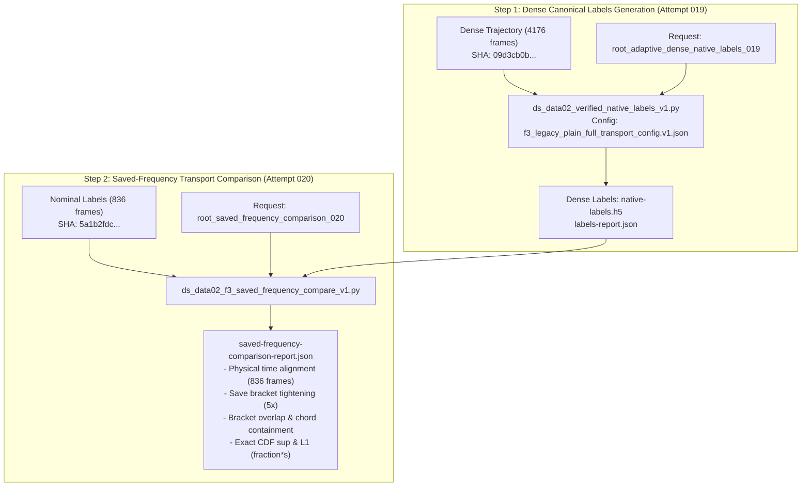

# F3 Saved-Frequency Transport Comparison Plan & Specification (Followup 022)

**Owner**: Delegated Family F3/F7 Owner (Historical Reuse & Qualification Pipeline)  
**Date**: 2026-10-03  
**Status**: Prepared for Root Strict Review & Dispatch  
**Target Window**: Full 8.35s physical window ([0.0, 8.35] s, 167,001 forcing rows)  
**Subject Case**: `F3_CELL3_LONG_DP0075_REPAIR1_ADAPTIVE_CFL05_COEF005` (CFL=0.05, CoefDtMin=0.005, DTsMin=0, 383,190 steps)  

---

## 1. Executive Summary & Review of Recent Root Artifacts

### 1.1 Root Macro Audit Attempt 017 Review
- **Execution**: Root successfully dispatched and completed `root-cell3-genuine-adaptive-full835-frozen-macro-v2-017` in 191.1s (exit code 0, receipt SHA `55477` bytes).
- **Core Results**:
  * Evaluated on continuous physical times 0..8.35s across 836 frames using frozen canonical operator `f3_observation_v2.py`.
  * **All seven registered 1% temporal macro metrics passed**:
    - `tv`: maximum 0.0010478 (0.105%) at t=7.37s (budget: 0.01) — **PASS**
    - `com_l2_over_length`: maximum 0.0002734 (0.027%) at t=7.47s (budget: 0.01) — **PASS**
    - `q90_over_length`: maximum 0.0009582 (0.096%) at t=7.27s (budget: 0.01) — **PASS**
    - `mean_velocity_over_U`: maximum 0.0009225 (0.092%) at t=6.78s (budget: 0.01) — **PASS**
    - `energy_difference`: maximum 0.0005772 (0.058%) at t=7.24s (budget: 0.01) — **PASS**
    - `common_support_velocity_over_U`: maximum 0.0018504 (0.185%) at t=6.48s (budget: 0.01) — **PASS** (largest relative discrepancy)
    - `unmatched_support_mass`: maximum 2.637774e-08 at t=7.57s (budget: 0.01) — **PASS**
- **Scientific Claim Boundary**:
  * This is a **temporal positive only**, establishing macroscopic hydrodynamic stability under adaptive CFL halving.
  * It does **NOT** constitute overall Q-N qualification. Transport fate switches (1,388 UID switches, 12.38%) and censored histories remain active negative findings that must be preserved.

### 1.2 Root Dense Native Solver Run 018 & Postprocess 019 Review
- **Native Solver Run 018**:
  * Executed `DualSPHysics5.4_linux64` with effective CLI override `-tout:0.002` on the identical prepared case (`F3_CELL3_LONG_DP0075_REPAIR1_ADAPTIVE_CFL05_COEF005`).
  * Yielded exactly 4,176 frames across the full 8.35s window.
  * Physics: CFL=0.05, CoefDtMin=0.005, DTsMin=0, total solver steps = 383,190 (**exact match** to nominal baseline steps).
- **Timestep Audit 019**:
  * Executed `root-cell3-adaptive-dense-full4176-native-timestep-v3-019` (returncode 0).
  * Effective CLI save: 0.002s; actual native save intervals: [0.001978, 0.002021] s.
  * DT adjustments = 0; floor incidence fraction = 0.0% (unclamped Symplectic).
- **Typed NVMe Conversion 019**:
  * Executed `root-cell3-adaptive-baseline-dense-full4176-typed-nvme-conversion-019` (returncode 0, elapsed 1249s).
  * Generated published trajectory: `trajectory.h5` (6,836,097,537 bytes, SHA-256 `09d3cb0b98d6ff959d9f4bcf8586c4884f059a171c21cc8bcf97cdd987cb1911`).
  * Cohort: exactly 108,000 identities (73,440 fixed, 34,560 fluid). Initial mass: 14.580000378191471 kg.
- **Historical Dense Inequivalence**:
  * Historical dense case `F3_REV075_R075-OUTPUT` was generated under a fixed-timestep recipe, not an adaptive CFL recipe. It is **non-equivalent** and cannot replace an adaptive study.

### 1.3 Treatment of Inherited Uncommitted Macro Script
- The inherited uncommitted script `ds_data02_f3_genuine_adaptive_macro_audit_v1.py` is treated as **UNADOPTED** and preserved byte-for-byte in the worktree.
- Its known limitations (saved-index pairing, missing UID validation, velocity-zero fallback) are documented.
- We do not duplicate Root's completed actual macro017 audit.

---

## 2. Scientific Motivation & Core Hypotheses

In Root Attempt 016 (`genuine-adaptive-paired-transport-report.json`), comparing baseline ($CFL=0.05$) vs half ($CFL=0.025$) at nominal $\Delta t_{\text{save}} = 0.01\text{ s}$ showed:
1. Low CDF knot supremum deviation: **0.001823 (0.182%)** at $t=8.3009\text{ s}$.
2. Small joint cohort median chord passage delta: **$1.0087\text{ ms}$**.
3. **Save-bracket non-overlap**: 2,785 particles (**24.83%**) exhibited empty bracket intersection ($[t_{\text{entry}}^{\text{base}}, t_{\text{exit}}^{\text{base}}] \cap [t_{\text{entry}}^{\text{half}}, t_{\text{exit}}^{\text{half}}] = \emptyset$).

Because baseline and half had differing numerical trajectories, chord deltas diverging by more than 10 ms produced empty intersections.
By comparing nominal save cadence ($\Delta t = 0.01\text{ s}$, 836 frames) against dense save cadence ($\Delta t = 0.002\text{ s}$, 4,176 frames) on the **SAME physical simulation run** (383,190 solver steps), we achieve:
- **Pure temporal discretization error isolation**: Differences in chord passage times or save brackets arise exclusively from the temporal save cadence (save-bracket quantization), not from solver divergence.
- **Save-bracket containment testing**: Does refining the bracket width by 5x (from 10 ms to 2 ms) bracket the true chord time and provide bracket overlap?

---

## 3. Methodological Specification & Safeguards

### 3.1 Physical-Time Alignment (No Saved-Index Pairing)
- **Saved-Index Pairing is Prohibited**: Comparing frame $k$ with frame $k$ would introduce a 5x temporal mismatch ($t=0.01k$ vs $t=0.002k$).
- **Continuous Physical Alignment**:
  * For any nominal frame $k$ at time $t_k^{\text{nom}}$, find dense frame $j = \arg\min | t_j^{\text{dense}} - t_k^{\text{nom}} |$.
  * Verify alignment tolerance: $| t_j^{\text{dense}} - t_k^{\text{nom}} | \le \frac{1}{2} \Delta t_{\text{dense}} + 10^{-9}\text{ s} \approx 0.001\text{ s}$.
  * At matched physical times, evaluate instantaneous particle destination agreement across all 34,560 fluid particles.

### 3.2 Strict UID Validation (No Velocity-Zero Fallback)
- Exact 1-to-1 match of all 108,000 particle identity keys `(particle_zone, particle_id)` between nominal and dense datasets.
- Source assignment `source_label` must be identical for every particle.
- Fluid cohort count must be exactly 34,560 particles; initial mass must sum to 14.580000378191471 kg.
- No synthetic zero velocities or fallback fabrications are introduced.

### 3.3 Save Bracket & Chord Passage Quantification
For each joint-observed particle $i$ in event $e$:
- Nominal bracket: $[t_{\text{entry}, i}^{\text{nom}}, t_{\text{exit}, i}^{\text{nom}}]$ (width $W_{\text{nom}, i} \approx 10\text{ ms}$).
- Dense bracket: $[t_{\text{entry}, i}^{\text{dense}}, t_{\text{exit}, i}^{\text{dense}}]$ (width $W_{\text{dense}, i} \approx 2\text{ ms}$).
- Tightening factor: $W_{\text{nom}, i} / W_{\text{dense}, i} \approx 5.0$.
- Bracket intersection: $[ \max(t_{\text{entry}, i}^{\text{nom}}, t_{\text{entry}, i}^{\text{dense}}), \min(t_{\text{exit}, i}^{\text{nom}}, t_{\text{exit}, i}^{\text{dense}}) ]$.
  * Overlap count & fraction: particles with non-empty intersection.
  * Non-overlap count & fraction: particles with empty intersection.
- Chord containment:
  * Dense chord inside nominal bracket: $t_{\text{dense}, i}^* \in [t_{\text{entry}, i}^{\text{nom}}, t_{\text{exit}, i}^{\text{nom}}]$.
  * Nominal chord inside dense bracket: $t_{\text{nom}, i}^* \in [t_{\text{entry}, i}^{\text{dense}}, t_{\text{exit}, i}^{\text{dense}}]$.
- Chord delta: $\Delta t_i = t_{\text{dense}, i}^* - t_{\text{nom}, i}^*$, with median, mean signed, mean absolute, p75, p90, p95, p99, and mass-weighted statistics.

### 3.4 Full Cohort Empirical CDF & Fate Contingency
- Evaluated over the complete physical window $[0.0, \min(t_{\text{end,nom}}, t_{\text{end,dense}}, 8.35\text{ s})]$.
- Exact knot supremum deviation evaluated over all union jump knots.
- $L_1$ integrated deviation in units of `fraction * s`.
- Conditional zero CDF handling: prevents empty-array indexing errors on all-censored events.
- Four-way fate contingency table:
  * Jointly observed count & fraction
  * Nominal-only observed count & fraction (dense-censored)
  * Dense-only observed count & fraction (nominal-censored)
  * Jointly censored count & fraction
  * Fate switch count & fraction

### 3.5 Provenance & Claim Boundary
- Records both nominal XML `TimeOut=0.01` and effective CLI `-tout:0.002`.
- Initial native mass 14.580000378191471 kg and fluid particle count 34,560 recorded.
- No arbitrary 5% autogates; findings are framed purely as descriptive measurements.
- Claim boundaries:
  * `model_invoked: false`
  * `production: "not_evaluated"`
  * `production_granted: false`
  * `q_i: "saved_frequency_comparison_measurement_only"`
  * `q_n: "not_assessed"`
  * `q_n_granted: false`
  * `training: "not_authorized"`

---

## 4. Execution Workflow for Root

### Step 1: Materialize Dense Labels
- Dispatched via Root strict dispatcher:
  `campaigns/ds-data-02/families/F3/handoff_20261003/root_adaptive_dense_native_labels_019/request.json`
- Generates:
  `root-cell3-adaptive-baseline-dense-native-transport-labels-019/native-labels.h5`
  `root-cell3-adaptive-baseline-dense-native-transport-labels-019/labels-report.json`

### Step 2: Bind & Execute Saved-Frequency Comparison
- Root binds the completed dense label artifact hashes into:
  `campaigns/ds-data-02/families/F3/handoff_20261003/root_saved_frequency_comparison_020/binding.json`
  `campaigns/ds-data-02/families/F3/handoff_20261003/root_saved_frequency_comparison_020/request.json`
- Dispatched via Root strict dispatcher to execute:
  `scripts/ds_data02_f3_saved_frequency_compare_v1.py`
- Produces final comparison report: `saved-frequency-comparison-report.json`.

---

## 5. Input Artifact Digests & Hash Provenance

| Artifact | Resolved Absolute Path | Verified SHA-256 |
|---|---|---|
| **Nominal Trajectory** | `/home/jade/Projects/DualSPHysics-data/ds-data-02/families/F3/F3_CELL3_LONG_DP0075_REPAIR1_ADAPTIVE_CFL05_COEF005/root-cell3-adaptive-floor-fulltyped-nvme-conversion-008/trajectory.h5` | `d077e7099ed4f6e4a359340b741a2ca65703fae60a9826990e55d88029711804` |
| **Nominal Labels H5** | `/home/jade/Projects/DualSPHysics-data/ds-data-02/families/F3/F3_CELL3_LONG_DP0075_REPAIR1_ADAPTIVE_CFL05_COEF005/root-cell3-adaptive-baseline-native-transport-labels-012/native-labels.h5` | `5a1b2fdc7c14b597002ad913f0cfa02253eb08392aad04a6b5b2e764996e41a1` |
| **Nominal Labels Report** | `/home/jade/Projects/DualSPHysics-data/ds-data-02/families/F3/F3_CELL3_LONG_DP0075_REPAIR1_ADAPTIVE_CFL05_COEF005/root-cell3-adaptive-baseline-native-transport-labels-012/labels-report.json` | `9d1b6cda78a92b3e2fffe697aef8c3df4d5855558f61884db9dae8122934581b` |
| **Dense Trajectory H5** | `/home/jade/Projects/DualSPHysics-data/ds-data-02/families/F3/F3_CELL3_LONG_DP0075_REPAIR1_ADAPTIVE_CFL05_COEF005_DENSE_SAVE002/root-cell3-adaptive-baseline-dense-full4176-typed-nvme-conversion-019/trajectory.h5` | `09d3cb0b98d6ff959d9f4bcf8586c4884f059a171c21cc8bcf97cdd987cb1911` |
| **Dense Conversion Report** | `/home/jade/Projects/DualSPHysics-data/ds-data-02/families/F3/F3_CELL3_LONG_DP0075_REPAIR1_ADAPTIVE_CFL05_COEF005_DENSE_SAVE002/root-cell3-adaptive-baseline-dense-full4176-typed-nvme-conversion-019/conversion-report.json` | `37f66f1127a3be538fa5280e3b0da898f0d5e8a79ad1ae948407d7d1efd73023` |
| **Dense Conversion Receipt**| `/home/jade/Projects/DualSPHysics-data/ds-data-02/families/F3/F3_CELL3_LONG_DP0075_REPAIR1_ADAPTIVE_CFL05_COEF005_DENSE_SAVE002/root-cell3-adaptive-baseline-dense-full4176-typed-nvme-conversion-019/execution-receipt.json` | `00963f0b3b0b292dae7e162f2788d6f76d5eb61b2f83e30379eac2626b90ffb6` |
| **Dense Solver Receipt** | `/home/jade/Projects/DualSPHysics-data/ds-data-02/families/F3/F3_CELL3_LONG_DP0075_REPAIR1_ADAPTIVE_CFL05_COEF005_DENSE_SAVE002/root-cell3-adaptive-baseline-full835-save002-native-018/execution-receipt.json` | `d143559f973fde0a5d44bea43426ee7ff06c2ebda9a629c8c024399307bf6bf6` |
| **Dense Timestep Report** | `/home/jade/Projects/DualSPHysics-data/ds-data-02/families/F3/F3_CELL3_LONG_DP0075_REPAIR1_ADAPTIVE_CFL05_COEF005_DENSE_SAVE002/root-cell3-adaptive-dense-full4176-native-timestep-v3-019/timestep-report.json` | `3af8ebfacae69eb8e3abb12075043d0a5d339f1a81e94661357b638baf71a432` |
| **Transport Config** | `lagrangian-fluid-lab/campaigns/ds-data-02/families/F3/legacy_plain_8/f3_legacy_plain_full_transport_config.v1.json` | `69c3a4789d9f92e0f360067f3ee115cc65fc1adb42a5869a7944d64f2b3338d8` |
| **F3 Protocol** | `/home/jade/Projects/DualSPHysics/lagrangian-fluid-lab/campaigns/l1-resume/continuation/F3-CELL3-PROTOCOL.json` | `6e533c03bcbc78ea026aac233b15e5c066dd18f5736e98ce22b0a43588a40c15` |
| **Labels Generator** | `lagrangian-fluid-lab/scripts/ds_data02_verified_native_labels_v1.py` | `4c4860c192505fff6f729c8a67ee9df7590037f379fe6dc78267dbb306f0451e` |
| **Comparison Script v1** | `lagrangian-fluid-lab/scripts/ds_data02_f3_saved_frequency_compare_v1.py` | `172fc3fbb51de3e060aa75a609abbfadfd68a2269635681ab2c2f1fee6fa7339` |
| **Strict Dispatch Guard** | `lagrangian-fluid-lab/scripts/ds_data02_strict_dispatch_v1.py` | `81bdd60e5de4fec362807043ab632864405f1667a0658560fb9349025aab75ec` |
| **Shared Runtime v2** | `lagrangian-fluid-lab/scripts/ds_data02_runtime_v2.py` | `5098262e26dc5560487760181466b0a93a0e66239e5e54047dce5e761ae67a60` |
| **Dense Labels Binding** | `lagrangian-fluid-lab/campaigns/ds-data-02/families/F3/handoff_20261003/root_adaptive_dense_native_labels_019/binding.json` | `7c320da787f38029ada6f4accb20f4dcf0fcc0ecf54249d0bbb1db3e759d426d` |
| **Saved Freq Binding** | `lagrangian-fluid-lab/campaigns/ds-data-02/families/F3/handoff_20261003/root_saved_frequency_comparison_020/binding.json` | `cf750c5991b6de3fd6f046bd7e6cf79cd94d5d355ccb5c1d3653a9d28e349d52` |

---

## 6. Verification Status
- **Synthetic Unit Tests**: All 23 unit tests pass across the test suite (`pytest -v`), including 6 dedicated synthetic tests in `test_ds_data02_f3_saved_frequency_compare_synthetic.py` testing physical-time alignment, UID validation, bracket analysis, and conditional zero CDF handling.
- **Strict Dispatch Preflight**: Preflight validation of `root_adaptive_dense_native_labels_019/request.json` passed with zero errors under `ds_data02_strict_dispatch_v1.py`.
- **Zero Solver Launches**: No GPU runs, conversions, or actual-data analyses were launched outside the Root runtime.
