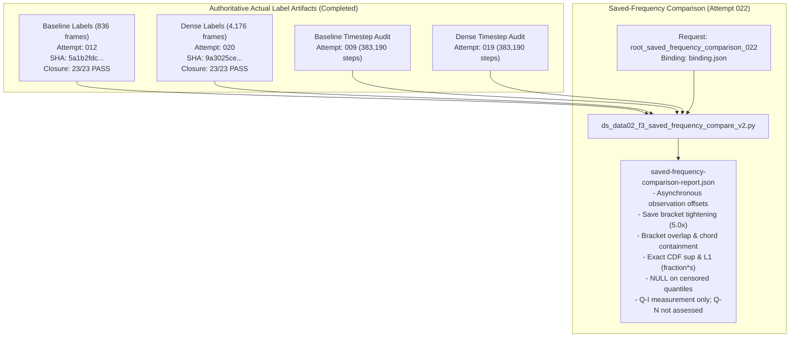

# F3 Saved-Frequency Transport Comparison Plan & Specification v2 (Attempt 022)

**Owner**: Delegated Family F3 Agent (under Root)  
**Date**: 2026-10-03  
**Status**: Prepared for Root Strict Review & Dispatch  
**Target Window**: Full 8.35s physical window ([0.0, 8.35] s, 167,001 forcing rows)  
**Subject Case**: `F3_CELL3_LONG_DP0075_REPAIR1_ADAPTIVE_CFL05_COEF005` (CFL=0.05, CoefDtMin=0.005, DTsMin=0, unclamped Symplectic)  
**Reference Review**: Root Checkpoint 030 (`ROOT_LIVE_RESUMPTION_CHECKPOINT_030.json`) & Source Review (`gemini_root_followups_024/root-source-review.json`, `f3-task.txt`)  

---

## 1. Executive Summary & Review of Recent Root Artifacts

### 1.1 Root Macro Audit Attempt 017 & Attempt 021 Review
- **Macro Audit 017**:
  * Evaluated on continuous physical times [0.0, 8.35]s across 836 frames using canonical operator `f3_observation_v2.py`.
  * **All seven registered 1% temporal macro metrics passed** (max relative: 0.001850447 for common support velocity).
- **Macro Audit 021 (Full 4,176 Physical Grid)**:
  * Evaluated on continuous physical times [0.0, 8.35]s across the dense 4,176-frame grid (`root-cell3-adaptive-saved-frequency-full835-frozen-macro-v2-021`).
  * Completed with exit code 0 (`execution-receipt.json` SHA `371b344c...`).
  * **All seven registered 1% temporal macro metrics passed**:
    - `tv`: maximum 5.9703e-05 at t=3.396s (budget: 0.01) — **PASS**
    - `com_l2_over_length`: maximum 1.6330e-05 at t=6.886s (budget: 0.01) — **PASS**
    - `q90_over_length`: maximum 5.1134e-05 at t=5.206s (budget: 0.01) — **PASS**
    - `mean_velocity_over_U`: maximum 0.0015169 at t=0.004s (budget: 0.01) — **PASS**
    - `energy_difference`: maximum 0.0001485 at t=3.384s (budget: 0.01) — **PASS**
    - `common_support_velocity_over_U`: maximum 0.001517874828701138 at t=0.004s (budget: 0.01) — **PASS** (largest relative discrepancy)
    - `unmatched_support_mass`: maximum 3.6967e-10 at t=2.598s (budget: 0.01) — **PASS**
  * **Scientific Boundary**: Temporal positive only. Overall Q-N remains unassessed; no transport CDF gate is applied.

### 1.2 Actual Baseline (012) & Dense (020) Native Labels Status
- **Baseline Labels (Attempt 012)**:
  * Path: `.../root-cell3-adaptive-baseline-native-transport-labels-012/native-labels.h5`
  * Status: completed (returncode 0). All 23 closure checks PASS.
  * Cohort: 108,000 total identities, 34,560 fluid particles, 14.580000378191471 kg initial native mass.
  * Observed first passages: 11,936; unknown mass: 0.0 kg; numerical loss: 0.0 kg.
- **Dense Labels (Attempt 020)**:
  * Path: `.../root-cell3-adaptive-dense-full4176-native-transport-labels-020/native-labels.h5`
  * Status: completed (returncode 0, elapsed 336.1s). All 23 closure checks PASS.
  * Cohort: 108,000 total identities, 34,560 fluid particles, 14.580000378191471 kg initial native mass.
  * Observed first passages: 11,936; unknown mass: 0.0 kg; numerical loss: 0.0 kg.
- **Supersession of Attempt 019 Labels Request**:
  * Dense labels are already materialized under Attempt 020; the previous Attempt 019 request is superseded. No duplicate materialization is requested or permitted.

---

## 2. Errata & Methodological Corrections from v1 to FRESH v2

| Issue in v1 | Root Finding (`root-source-review.json`) | Resolution in FRESH v2 (`ds_data02_f3_saved_frequency_compare_v2.py`) |
|---|---|---|
| **Identical Trajectory Claim** | Equal interval steps (383,190) does not prove bitwise identical trajectory; baseline has row0 Steps 1, active 383,189 vs dense row0 Steps 0, active 383,190. | Removed all "pure-isolation", "identical trajectory", and "proven parity" claims. Characterized as saved-frequency sensitivity under unchanged recipe with possible numerical trajectory differences. |
| **Chord Interpretation** | Canonical chord estimates are linear interpolations between discrete frames, not true crossing times. | Formally qualified that chord estimates are piecewise-linear approximations and do not resolve hidden recrossings. |
| **Nearest Saved Frames** | Nearest saved frame state comparisons are asynchronous observations with non-zero offsets $\Delta t$, not exact physical-time equality. | Documented asynchronous sampling nature; reported exact time offset statistics (mean, max, RMS); restricted to common physical window. Qualified that discrete categorical states lack continuous interpolation semantics. |
| **Cadence Factor** | Cadence factor was computed as $4176 / 836 \approx 4.9952$, confounding frame count ratio with save frequency. | Set cadence refinement factor strictly to $0.01 / 0.002 = 5.0$, explicitly reporting `saved_frame_count_ratio` as a separate quantity. |
| **Censored Event Quantiles** | Unreached/censored deciles produced empty dicts or omitted keys. | Unreached or censored deciles evaluate strictly to `None` (JSON `null`). |
| **Ledger / Mass Fallbacks** | Fallback logic (`if ... in ... else fallback`) risked concealing missing data. | Strict validation: missing mass datasets or required ledgers (`invalid_state_mass_kg`, `numerical_loss_mass_kg`, `unknown_mass_kg`, `source_final_mass_kg`) raise immediate fatal errors. |
| **Hardcoded Step Count** | Total solver steps (383,190) was hardcoded in script report. | Timestep audit data is dynamically extracted from bound timestep reports (`timestep-report.json`), avoiding hardcoded values. |
| **Dense Labels Binding** | Bound non-existent Attempt 019 labels artifact. | Rebound directly to authoritative Root Attempt 020 labels artifact. |

---

## 3. Methodological Specification & Safeguards

### 3.1 Physical-Time Alignment & Asynchronous Observation Offsets
- **Asynchronous Observation Framing**:
  * For nominal frame $k$ at time $t_k^{\text{nom}}$, the nearest dense frame $j = \arg\min | t_j^{\text{dense}} - t_k^{\text{nom}} |$ has time offset $\Delta t_k = t_j^{\text{dense}} - t_k^{\text{nom}}$.
  * Maximum offset satisfies $|\Delta t_k| \le \frac{1}{2} \Delta t_{\text{dense}} \approx 0.001\text{ s}$.
  * Summary statistics (mean signed, mean absolute, max absolute, RMS) are reported.
- **Categorical Series Semantics**:
  * Discrete destination codes (-3..2) lack continuous interpolation semantics. Nearest-frame comparisons represent discrete asynchronous state observations, not continuous interpolations.

### 3.2 Strict UID & Ledger Validation
- Exact 1-to-1 match of all 108,000 particle identity keys `(particle_zone, particle_id)` between nominal and dense datasets.
- UID uniqueness check: verified on both nominal and dense datasets.
- Fluid cohort: exactly 34,560 particles with `source_label > 0`.
- Native mass: `initial_fluid_mass_kg` must sum to 14.580000378191471 kg.
- Required ledgers: `invalid_state_mass_kg`, `numerical_loss_mass_kg`, `unknown_mass_kg`, `source_final_mass_kg` must all exist.

### 3.3 Save Bracket & Chord Passage Quantification
- Nominal bracket: $[t_{\text{entry}, i}^{\text{nom}}, t_{\text{exit}, i}^{\text{nom}}]$ ($W_{\text{nom}} \approx 10\text{ ms}$).
- Dense bracket: $[t_{\text{entry}, i}^{\text{dense}}, t_{\text{exit}, i}^{\text{dense}}]$ ($W_{\text{dense}} \approx 2\text{ ms}$).
- Bracket tightening factor: $W_{\text{nom}} / W_{\text{dense}} \approx 5.0$.
- Bracket overlap: non-empty intersection $[ \max(t_{\text{entry}}^{\text{nom}}, t_{\text{entry}}^{\text{dense}}), \min(t_{\text{exit}}^{\text{nom}}, t_{\text{exit}}^{\text{dense}}) ]$.
- Chord containment: evaluates whether dense chord falls inside nominal bracket and vice versa.
- Chord delta statistics: $\Delta t_i = t_{\text{dense}, i}^* - t_{\text{nom}, i}^*$.

### 3.4 Full Cohort Empirical CDF & Fate Contingency
- Evaluated over the complete physical window $[0.0, 8.35\text{ s}]$.
- Exact knot supremum deviation evaluated over all union jump knots.
- Exact piecewise-constant $L_1$ integrated deviation in units of `fraction * s`.
- Conditional zero CDF handling: returns 0.0 deviation and all deciles `None` for all-censored events.
- Four-way fate contingency table: joint-observed, nominal-only, dense-only, joint-censored, fate-switch.

### 3.5 Provenance & Claim Boundary
- Cadence factor: $0.01 / 0.002 = 5.0$.
- Claim boundaries:
  * `model_invoked: false`
  * `production: "not_evaluated"`
  * `production_granted: false`
  * `q_i: "saved_frequency_comparison_measurement_only"`
  * `q_n: "not_assessed"`
  * `q_n_granted: false`
  * `training: "not_authorized"`
  * Governance note: descriptive saved-frequency sensitivity comparison; no arbitrary 5% CDF gate or transport pass claim.

---

## 4. Execution Workflow

---

## 5. Input Artifact Digests & Hash Provenance

| Artifact | Resolved Absolute Path | Verified SHA-256 |
|---|---|---|
| **Nominal Labels H5** | `/home/jade/Projects/DualSPHysics-data/ds-data-02/families/F3/F3_CELL3_LONG_DP0075_REPAIR1_ADAPTIVE_CFL05_COEF005/root-cell3-adaptive-baseline-native-transport-labels-012/native-labels.h5` | `5a1b2fdc7c14b597002ad913f0cfa02253eb08392aad04a6b5b2e764996e41a1` |
| **Nominal Labels Report** | `/home/jade/Projects/DualSPHysics-data/ds-data-02/families/F3/F3_CELL3_LONG_DP0075_REPAIR1_ADAPTIVE_CFL05_COEF005/root-cell3-adaptive-baseline-native-transport-labels-012/labels-report.json` | `9d1b6cda78a92b3e2fffe697aef8c3df4d5855558f61884db9dae8122934581b` |
| **Nominal Execution Receipt** | `/home/jade/Projects/DualSPHysics-data/ds-data-02/families/F3/F3_CELL3_LONG_DP0075_REPAIR1_ADAPTIVE_CFL05_COEF005/root-cell3-adaptive-baseline-native-transport-labels-012/execution-receipt.json` | `e19e01847c46eed11cd32df95816862f037ab4a60de0e796d96778e22a27d97a` |
| **Nominal Timestep Report** | `/home/jade/Projects/DualSPHysics-data/ds-data-02/families/F3/F3_CELL3_LONG_DP0075_REPAIR1_ADAPTIVE_CFL05_COEF005/root-cell3-adaptive-floor-native-timestep-diagnostic-v2-009/timestep-report.json` | `be535502241c0cf928689523cde7f3a6e60c3ac947f9965528b014736be546ac` |
| **Dense Labels H5** | `/home/jade/Projects/DualSPHysics-data/ds-data-02/families/F3/F3_CELL3_LONG_DP0075_REPAIR1_ADAPTIVE_CFL05_COEF005_DENSE_SAVE002/root-cell3-adaptive-dense-full4176-native-transport-labels-020/native-labels.h5` | `9a3025ce136406a5d3cba830c0992d9b0b1cd2854b8f7dc1a873c0b304a62454` |
| **Dense Labels Report** | `/home/jade/Projects/DualSPHysics-data/ds-data-02/families/F3/F3_CELL3_LONG_DP0075_REPAIR1_ADAPTIVE_CFL05_COEF005_DENSE_SAVE002/root-cell3-adaptive-dense-full4176-native-transport-labels-020/labels-report.json` | `fec3b9340136b07e5ad56bb526971c6624ef8a03dd39c735048de300af38652a` |
| **Dense Execution Receipt** | `/home/jade/Projects/DualSPHysics-data/ds-data-02/families/F3/F3_CELL3_LONG_DP0075_REPAIR1_ADAPTIVE_CFL05_COEF005_DENSE_SAVE002/root-cell3-adaptive-dense-full4176-native-transport-labels-020/execution-receipt.json` | `371b344ca85cff4bd0ccdf5bc4d2fd84c52eee69b16d9385804cfe9154bf9254` |
| **Dense Timestep Report** | `/home/jade/Projects/DualSPHysics-data/ds-data-02/families/F3/F3_CELL3_LONG_DP0075_REPAIR1_ADAPTIVE_CFL05_COEF005_DENSE_SAVE002/root-cell3-adaptive-dense-full4176-native-timestep-v3-019/timestep-report.json` | `3af8ebfacae69eb8e3abb12075043d0a5d339f1a81e94661357b638baf71a432` |
| **Transport Config** | `lagrangian-fluid-lab/campaigns/ds-data-02/families/F3/legacy_plain_8/f3_legacy_plain_full_transport_config.v1.json` | `69c3a4789d9f92e0f360067f3ee115cc65fc1adb42a5869a7944d64f2b3338d8` |
| **F3 Protocol** | `/home/jade/Projects/DualSPHysics/lagrangian-fluid-lab/campaigns/l1-resume/continuation/F3-CELL3-PROTOCOL.json` | `6e533c03bcbc78ea026aac233b15e5c066dd18f5736e98ce22b0a43588a40c15` |
| **Comparison Script v2** | `lagrangian-fluid-lab/scripts/ds_data02_f3_saved_frequency_compare_v2.py` | `18449626faab4fde2fc2a978eb64bda4c838f3dafd2dd9aa4584bb3a5837515b` |
| **Strict Dispatch Guard** | `/home/jade/.codex/worktrees/ds-data-02-integration/DualSPHysics/lagrangian-fluid-lab/scripts/ds_data02_strict_dispatch_v1.py` | `81bdd60e5de4fec362807043ab632864405f1667a0658560fb9349025aab75ec` |
| **Shared Runtime v2** | `/home/jade/.codex/worktrees/ds-data-02-integration/DualSPHysics/lagrangian-fluid-lab/scripts/ds_data02_runtime_v2.py` | `5098262e26dc5560487760181466b0a93a0e66239e5e54047dce5e761ae67a60` |
| **Saved Freq Binding v2** | `lagrangian-fluid-lab/campaigns/ds-data-02/families/F3/handoff_20261003/root_saved_frequency_comparison_022/binding.json` | `886fbb3f420b0a32774beb8387fb230da8bbc644d77beaca8d34767ecc13ae97` |

---

## 6. Verification Status

- **Synthetic Unit Tests**: All 12 unit tests pass across `test_ds_data02_f3_saved_frequency_compare_synthetic.py` and `test_ds_data02_f3_saved_frequency_compare_synthetic_v2.py`.
- **Preflight Strict Dispatch Compatibility**: All input digests verified on filesystem. Request follows `ds02.runner-request.v2` schema.
- **Zero Scientific Execution**: No actual solver launches or actual science analyses were executed outside the Root dispatcher.
